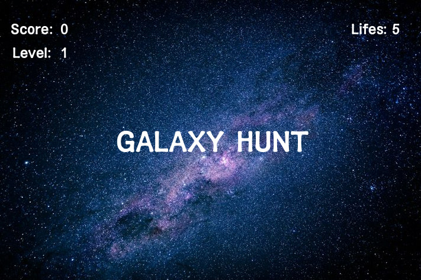
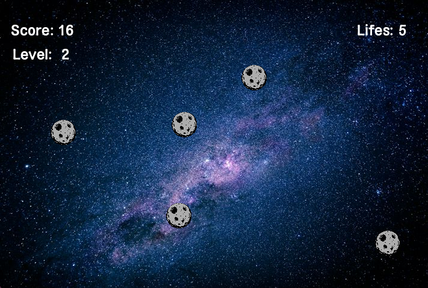
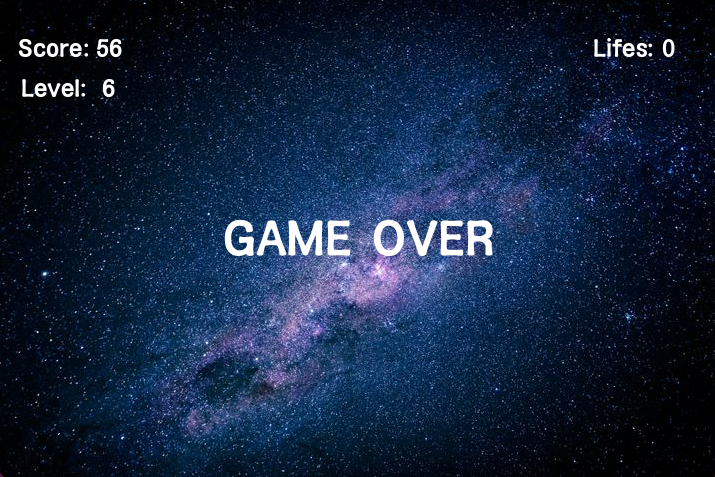

# Galaxy Hunt

## Description
Galaxy Hunt is an engaging arcade-style game developed using Processing, designed to challenge players' reflexes and strategic thinking. 

Players must shoot falling meteorites before they hit the ground, with each missed meteorite leading to a loss of lives.

The game dynamically increases in difficulty and introduces new levels over time, simulating gravity and incorporating fundamental programming concepts for realistic gameplay.

The intuitive design and progressive difficulty curve ensure a captivating experience for players while demonstrating core principles of game development and physics simulation.

## Installation
Ensure Processing is installed on your system. Then, download the project files and run `GalaxyHuntProjectoFinal.pde` using Processing.

## Requirements
- Processing 3.0 or later

## GamePlay

[Watch the Gameplay Video](./Video_GalaxyHunt.mp4)

